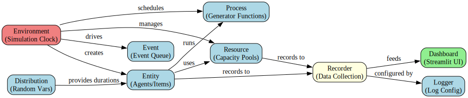
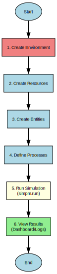

Architecture & Visualizations
=============================

This page provides visual representations of SimPM's structure, class hierarchies, and component relationships.

.. contents:: On this page
   :local:

SimPM Architecture
------------------

The following diagram shows the core components of SimPM and how they interact:

**Key Components:**

- **Environment** – Central simulation engine that manages time and events
- **Entity** – Agents that execute processes and interact with resources
- **Resource** – Shared capacities that entities compete for (crews, equipment, etc.)
- **Distribution** – Probabilistic models for durations and quantities
- **Process** – Generator functions that define entity lifecycles
- **Event Queue** – Priority queue that drives simulation forward
- **Recorder** – Collects and logs simulation data
- **Dashboard** – Interactive web interface for visualization
- **Logger** – Centralized logging configuration

Class Hierarchy
---------------

The following diagram shows the relationship between SimPM's main classes:

.. image:: ../_visualizations/simpm_classes.svg
   :alt: SimPM Class Hierarchy Diagram
   :align: center
   :width: 90%

**Class Descriptions:**

- **SimObject** – Base class for all simulation objects
- **Environment** – Container and clock for simulation
- **Entity** – Items/agents that move through the system
- **Resource** – FIFO capacity with queue management
- **PriorityResource** – Resources with priority-based queue ordering
- **PreemptiveResource** – High-priority tasks can interrupt low-priority ones
- **GeneralResource** – Generic wrapper for custom resource types

Simulation Workflow
-------------------

The typical workflow for creating and running a SimPM simulation:

**Workflow Steps:**

1. **Create Environment** – Initialize the simulation clock and event scheduler
2. **Define Resources** – Specify shared capacities (loaders, crews, equipment, etc.)
3. **Create Entities** – Instantiate agents/items that will move through the system
4. **Define Processes** – Write generator functions describing entity behavior
5. **Schedule Processes** – Register processes with the environment
6. **Run Simulation** – Execute until no future events remain (optionally show dashboard)
7. **Analyze Results** – Extract statistics, view logs, or export data

Data Flow
---------

How data flows through SimPM during a simulation:

**Data Flow Pipeline:**

1. **User Code** → Defines simulation structure (entities, resources, processes)
2. **Environment** → Processes events and advances simulation clock
3. **Entities & Resources** → Execute processes and generate events
4. **Recorder** → Collects all simulation data (activities, queues, status changes)
5. **Storage** → Data stored in three main logs:
   
   - **Schedule Log** – Entity activities and timings
   - **Queue Log** – Resource waiting times
   - **Status Log** – State changes over time

6. **Output** → Data visualized or exported:
   
   - **Dashboard** – Interactive Streamlit interface
   - **CSV Export** – Data files for external analysis

Module Dependencies
-------------------

Here's an overview of the main SimPM modules and their dependencies:

**Core Modules:**

- :mod:`simpm.des` – Discrete-event simulation engine
  
  - Environment
  - Entity
  - Resource variants (Resource, PriorityResource, PreemptiveResource)
  
- :mod:`simpm.dist` – Probability distributions
  
  - Triangular, Normal, Exponential, Beta, etc.
  - Supports 3-point and PERT estimates

- :mod:`simpm.recorder` – Data recording and logging
  
  - Entity schedule logging
  - Resource queue logging
  - Status change logging

- :mod:`simpm.dashboard` – Interactive web interface
  
  - Streamlit-based visualization
  - CSV export functionality
  - Multiple run support

- :mod:`simpm.log_cfg` – Centralized logging configuration
  
  - Console and file logging setup
  - Log level management

**Typical Import Pattern:**

.. code-block:: python

   import simpm
   import simpm.des as des
   import simpm.dist as dist
   
   # Create simulation environment
   env = des.Environment("My Project")
   
   # Define resources with logging
   loader = des.Resource(env, "loader", log=True)
   
   # Create entities
   trucks = env.create_entities("truck", 10, log=True)
   
   # Define stochastic durations
   load_time = dist.triang(5, 7, 9)
   
   # Run with dashboard
   simpm.run(env, dashboard=True)

Key Design Patterns
-------------------

**1. Generator-based Processes**

SimPM uses Python generators to define entity processes:

.. code-block:: python

   def truck_process(truck, loader, dumped_dirt):
       while True:
           # Wait for resource
           yield truck.get(loader, 1)
           
           # Perform activity
           yield truck.do("loading", 7)
           
           # Release resource
           yield truck.put(loader, 1)
           
           # Output to inventory
           yield truck.add(dumped_dirt, 60)

**2. Dictionary-like Attributes**

Entities support arbitrary metadata:

.. code-block:: python

   truck["load_size"] = 40
   truck["priority"] = 2
   truck["wbs_code"] = "A-123"
   
   # Access in process
   def process(entity, resource):
       duration = 5 + entity["load_size"] / 20
       yield entity.do("loading", duration)

**3. Time-weighted Statistics**

Resource and entity status logs are weighted by duration:

.. code-block:: python

   # Time-weighted average utilization
   loader.average_utilization()
   
   # Time-weighted statistics
   loader.status_log().describe()

**4. Composable Resources**

Multiple resource types for different scenarios:

.. code-block:: python

   # FIFO queue
   basic_res = des.Resource(env, "basic")
   
   # Priority queue
   priority_res = des.PriorityResource(env, "priority")
   
   # Preemptive (can interrupt)
   preempt_res = des.PreemptiveResource(env, "preempt")

See Also
--------

- :doc:`../getting-started` – Quick start guide
- :doc:`../concepts/project-modeling` – Conceptual overview
- :doc:`../api_reference/index` – Complete API reference
- :doc:`../tutorials/index` – Detailed tutorials
